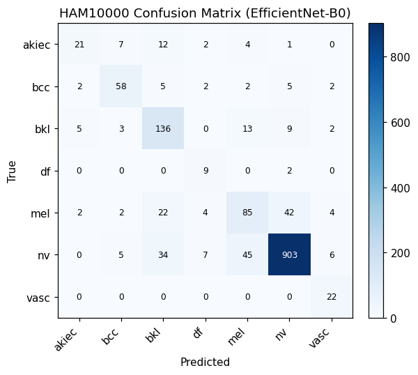
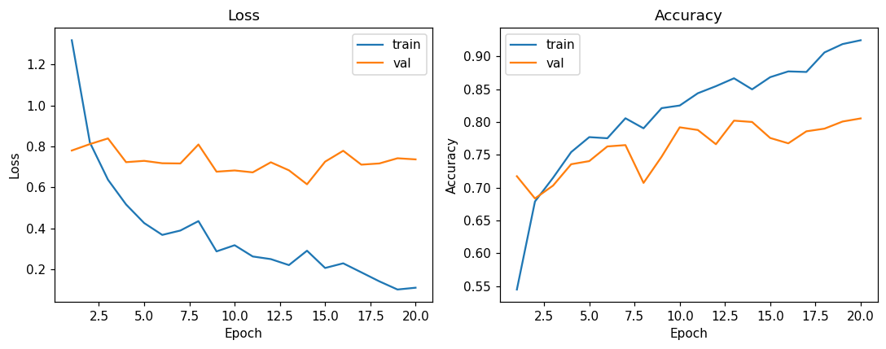

# oncology-diagnosis-cnn

[](https://python.org)
[](https://pytorch.org)
[](LICENSE)
[](https://github.com/motazalqaoud)

> A CNN-based skin lesion classifier fine-tuned on HAM10000, reporting the
> clinically-actionable metric (malignant-class sensitivity) that generic
> accuracy numbers hide.

A **CNN (Convolutional Neural Network)** -- specifically EfficientNet-B0 -- fine-tuned
on **HAM10000**, the standard dermatoscopic imaging benchmark for skin cancer
diagnosis. Classifies a lesion image into one of seven diagnostic categories and
flags the three that are malignant or pre-malignant.

**Live demo:** upload a dermatoscopic image and get per-class probabilities,
with malignant classes clearly flagged.

## Why this project

Most public skin-lesion classifiers stop at "here's the accuracy." This one is
built the way an oncology screening tool actually needs to be evaluated:
alongside overall accuracy, it reports **sensitivity on the malignant classes
specifically** (`evaluate.py`) -- because a model that's 95% accurate overall
but misses melanomas is not a usable screening aid. It also uses **lesion-level
stratified splitting** rather than naive random image splitting, since
HAM10000 contains repeat photographs of the same lesion; splitting by image
instead of by lesion silently leaks information between train and test sets
and inflates reported accuracy.

## The dataset

**HAM10000** ("Human Against Machine with 10000 training images"), Tschandl et
al., 2018 -- 10,015 dermatoscopic images across seven diagnostic categories,
each label verified by histopathology, expert consensus, confocal microscopy,
or follow-up.

| Class | Meaning | Malignant? |
|---|---|---|
| `akiec` | Actinic keratoses / intraepithelial carcinoma | Pre-malignant |
| `bcc` | Basal cell carcinoma | Malignant |
| `bkl` | Benign keratosis-like lesion | No |
| `df` | Dermatofibroma | No |
| `mel` | Melanoma | Malignant |
| `nv` | Melanocytic nevus (common mole) | No |
| `vasc` | Vascular lesion | No |

The dataset is heavily imbalanced (`nv` alone is ~67% of all images; `df` and
`vasc` are each under 2%), which the training pipeline addresses with
inverse-frequency class weighting in the loss function rather than naive
oversampling.

## Clinical context

> Most public skin-lesion classifiers stop at "here's the accuracy." Here's what's different about this repo:

| Common tutorial | This repo |
|---|---|
| Random image-level train/test split | **Lesion-level** stratified split |
| Report overall accuracy only | Report **malignant-class sensitivity, specificity, and false-negative count** |
| Naive oversampling for imbalance | Inverse-frequency **class-weighted loss** |
| No production path | Auto GPU-vs-CPU config presets, mixed precision, honest demo-mode fallback |
| Accuracy only | Full 7-class report + macro ROC-AUC + binary malignant/benign confusion matrix |

Dataset citation:
> Tschandl, P., Rosendahl, C. & Kittler, H. The HAM10000 dataset, a large
> collection of multi-source dermatoscopic images of common pigmented skin
> lesions. *Sci Data* 5, 180161 (2018). https://doi.org/10.7910/DVN/DBW86T

**The dataset is not bundled in this repo** (it's ~2.7GB). Download it
yourself from the Harvard Dataverse link above -- see Setup below.

## Architecture

EfficientNet-B0 (ImageNet-pretrained) with the classification head replaced by
a small dropout -> linear -> ReLU -> dropout -> linear stack fine-tuned on
HAM10000. This is a **classification CNN**, not a U-Net: the task here is
"which of 7 categories is this lesion," a whole-image decision, not
pixel-by-pixel segmentation (that's what the U-Net in
[brain-tumor-segmentation](https://github.com/motazalqaoud/Brain-Tumor-Segmentation)
is for). EfficientNet-B0 was chosen over heavier backbones (ResNet50,
EfficientNet-B4+) as a practical default -- it trains in a reasonable time on a
single consumer GPU and is small enough to serve cheaply in a Hugging Face
Space, while remaining competitive with larger architectures on this
particular dataset once fine-tuned (see Results below).

## Repository structure

```
oncology-diagnosis-cnn/
├── app.py                     Gradio demo (Hugging Face Spaces entry point)
├── data_prep.py                Verifies a downloaded dataset is laid out correctly
├── requirements.txt
├── configs/
│   ├── cpu.json                No GPU: small batch, no AMP -- pipeline verification only
│   ├── gpu_8gb.json             Consumer GPU (RTX 3060/4060): batch 32, AMP on
│   └── gpu_16gb_plus.json       HPC-class GPU (V100/A100): batch 128, AMP on
├── data/                       Dataset download instructions (data not bundled)
├── src/
│   ├── __init__.py
│   ├── preprocessing/
│   │   ├── __init__.py
│   │   └── dataset.py          HAM10000Dataset, transforms, lesion-stratified split
│   ├── classification/
│   │   ├── __init__.py
│   │   └── model.py             EfficientNet-B0 classifier, checkpoint loading
│   ├── visualization/
│   │   ├── __init__.py
│   │   └── plots.py             Confusion matrix + training curve plotters
│   ├── train.py                 Training loop: class-weighted loss, AMP, early stopping
│   ├── evaluate.py              7-class + binary malignant/benign metrics
│   └── predict.py               Single-image CLI inference
├── results/                    Confusion matrix and training curves (real checkpoint)
└── checkpoints/                 best_model.pth lands here after training (gitignored)
```

## Setup

```bash
git clone https://github.com/motazalqaoud/oncology-diagnosis-cnn
cd oncology-diagnosis-cnn
pip install -r requirements.txt
```

Download HAM10000 from the [Harvard Dataverse](https://doi.org/10.7910/DVN/DBW86T)
(`HAM10000_metadata.csv` + both image archives), unzip so you have:

```
HAM10000/
  HAM10000_metadata.csv
  HAM10000_images_part_1/
  HAM10000_images_part_2/
```

Then verify the layout:

```bash
python data_prep.py --data_dir HAM10000
```

## Training

```bash
python src/train.py --data_dir HAM10000 --config configs/gpu_8gb.json
```

Or without a preset:

```bash
python src/train.py --data_dir HAM10000 --epochs 30 --batch_size 32
```

### Hardware presets

| Config | Hardware | Batch size | AMP |
|---|---|---|---|
| `configs/cpu.json` | No GPU (pipeline verification only) | 8 | Off |
| `configs/gpu_8gb.json` | RTX 3060 / 4060 | 32 | On |
| `configs/gpu_16gb_plus.json` | V100 / A100 (HPC) | 128 | On |

Add `--freeze_backbone` for a fast sanity-check run that only trains the
classification head.

## CUDA setup (GPU training)

**1.** Install NVIDIA drivers (`nvidia-smi` to verify)  
**2.** `pip install torch torchvision --index-url https://download.pytorch.org/whl/cu121`  
**3.** Verify: `python -c "import torch; print(torch.cuda.is_available())"`

If CUDA isn't available, `train.py` falls back to CPU automatically.

## Evaluation

```bash
python src/evaluate.py --data_dir HAM10000 --checkpoint checkpoints/best_model.pth
```

## Inference on a single image

```bash
python src/predict.py --image path/to/lesion.jpg --checkpoint checkpoints/best_model.pth
```

## Running the demo locally

```bash
python app.py
```

If `checkpoints/best_model.pth` doesn't exist yet, the app runs in a
clearly-labeled demo mode. Train first and it will auto-detect the checkpoint.

## Results



*Actual 7-class confusion matrix on the held-out test set (1,485 images, lesion-level split).*



*Train/val loss and accuracy over 20 epochs (early-stopped at epoch 14 best val_loss, continued to epoch 20).*

| Metric | Value |
|---|---|
| **7-class accuracy** | **83.1%** |
| **Macro ROC-AUC** | **0.9647** |
| **Malignant sensitivity** | **64.4%** |
| **Malignant specificity** | **94.1%** |
| Binary ROC-AUC | 0.920 |
| False negatives (missed malignant) | **101 of 284** |
| TP=183, FN=101, FP=71, TN=1130 | -- |

Full evaluation on the held-out test split via `src/evaluate.py`.
Split: 7,055 train / 1,475 val / 1,485 test (lesion-level stratified).

**The 101 missed malignant lesions is the number to scrutinize** before
considering any downstream use -- a model that's 83% accurate overall but
misses 36% of malignant cases is not yet usable as a screening aid without
further improvement (larger backbone, heavier augmentation, ensemble, or a
higher-recall operating threshold).

## Limitations and disclaimer

**This is a research and portfolio project, not a medical device.** Not
validated prospectively, not reviewed by a regulatory body,
and must never be used to make or defer an actual diagnosis. HAM10000 also
skews toward lighter Fitzpatrick skin types, a well-documented limitation of
most public dermatology datasets. See a
dermatologist for any concerning skin lesion.

## Tech stack

| Tool | Purpose |
|---|---|
| `PyTorch` / `torchvision` | Deep learning, EfficientNet-B0 backbone |
| `pandas` | HAM10000 metadata handling |
| `scikit-learn` | Classification metrics, ROC-AUC |
| `Pillow` | Image loading |
| `Gradio` | Interactive demo |
| `matplotlib` | Confusion matrix, training curves |

## About the author

**Motaz Alqaoud, PhD**
- PhD in Biomedical Engineering with focus on medical image analysis and deep learning
- Senior AI/ML Engineer specializing in medical imaging, segmentation models, and clinical AI systems
- GitHub: [@motazalqaoud](https://github.com/motazalqaoud)
- LinkedIn: [linkedin.com/in/motazalqaoud](https://linkedin.com/in/motazalqaoud)

## License

MIT -- see [LICENSE](LICENSE).
